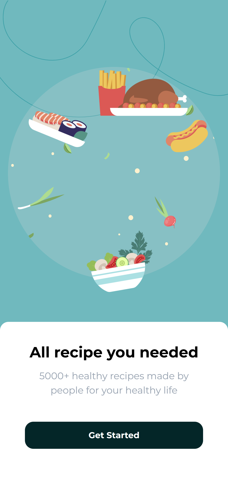
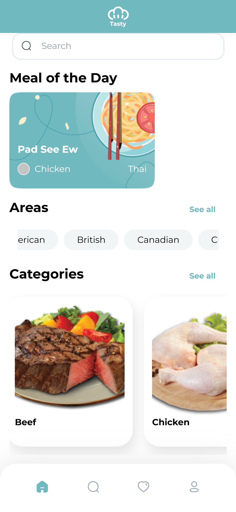
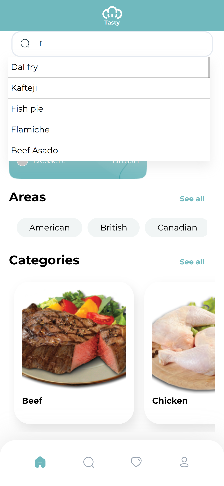
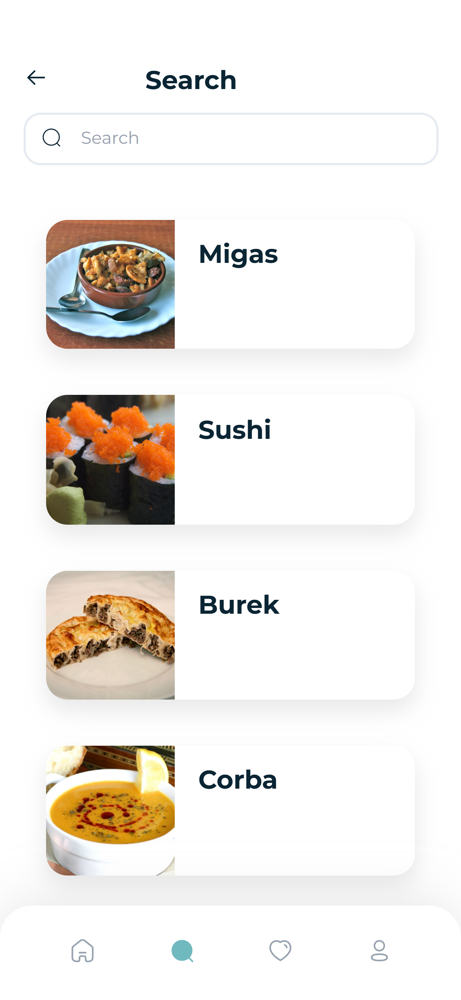
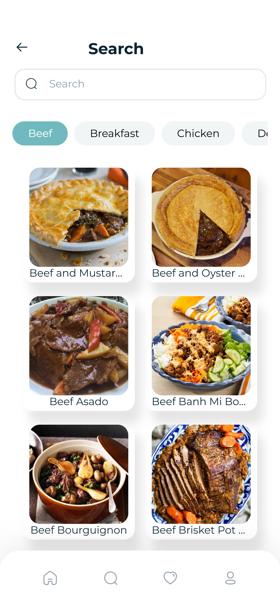
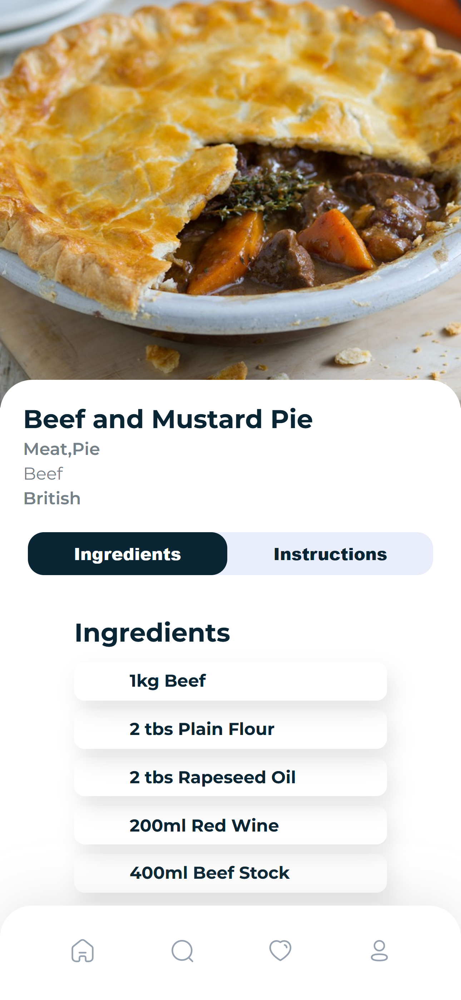
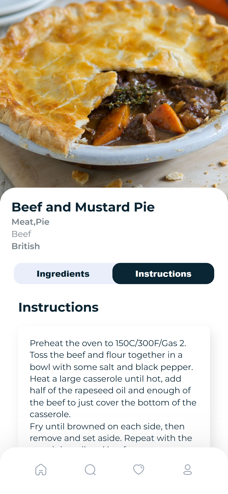

<h1 align="center"><samp>Tasty APP</samp> </h1>

 
  
  
  

<h3><samp>Contributors:</samp></h3>
<ul>
<a href="https://github.com/xoFrey"><li><samp>Izel Acar</samp></li></a>
<a href="https://github.com/EvenSalomon1"><li><samp>Even</samp></li></a>
<a href="https://github.com/icaroboaventura"><li><samp>Icaro</samp></li></a>
<a href="https://github.com/Zied1981"><li><samp>Zied</samp></li></a>

</ul>

<h3><samp>Build with:</samp></h3>
<ul>
<li><samp>ReactJS Vite</samp></li>
<li><samp>JavaScript</samp></li>
<li><samp>HTML5</samp></li>
<li><samp>CSS</samp></li>
<li><samp>themealdb API</samp></li>
</ul>

<samp>
<h2>App Features</h2>
<ul>
  <li>
    <strong>Homepage Display</strong>
    <ul>
      <li>Discover a random “Meal of the Day” each time you visit.</li>
      <li>Explore food by region with clickable Area links (e.g., French, Italian).</li>
      <li>Browse by Categories such as Desserts, Seafood, or Vegetarian.</li>
    </ul>
  </li>
  <li>
    <strong>Meal Search</strong>
    <ul>
      <li>Use the search bar to find meals by their name.</li>
    </ul>
  </li>
  <li>
    <strong>Meal Detail View</strong>
    <ul>
      <li>Click on a meal to view its full recipe details.</li>
      <li>See ingredients, measurements, and step-by-step cooking instructions.</li>
    </ul>
  </li>
  <li>
    <strong>Upcoming Features</strong>
    <ul>
      <li>Favorites: Save and revisit your favorite recipes anytime.</li>
      <li>Profile: Personalize your experience with custom user settings.</li>
    </ul>
  </li>
</ul>

</samp>

<h2><samp>Live site</samp></h2>

<samp>Once visiting the Live Page please ensure to put on Mobile Mode: Right Click, Inspect, CTRL+SHIFT+M to enable device toolbar</samp> 

<samp>This WebAPP is made for mobile devices, although it has a responsive Layout</samp> 

<li><samp><a href="https://tasty-app-flax.vercel.app">Live Page</a></samp></li>

<h2><samp>Screenshot</samp></h2>

 

 

 

 

